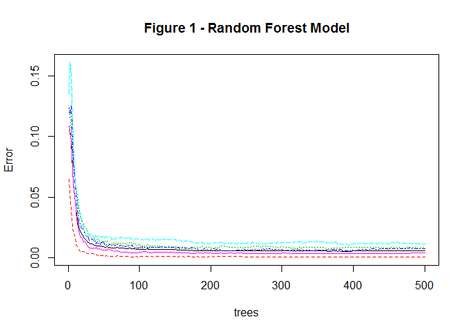
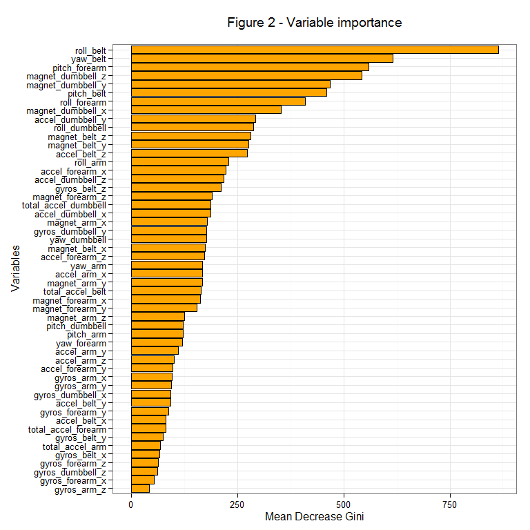

# Practical Machine Learning Project: Writeup
NunesHub  
23 May 2015  


### Executive Summary

For this study data obtained from accelerometers on the belt, forearm, arm, and dumbell of six participants were used. They were asked to perform barbell lifts correctly and incorrectly in 5 different ways and classified from A (correct and exactly according to the specification) to E. Further information regarding the experiment can be found [here][1]. The training data for this project are available [here][2] and the test data are available [here][3].

The objective of this project is to develop a machine learning algorithm to predict the manner in which the participants performed the exercise, that is, to predict the variable "classe". The model developed was a Random Forest model, with a high level of accuracy (above 99%). It was applied to 20 test cases available in the test data mentioned above and submitted separately. All 20 cases were accurately predicted.


### 1. Loading packages

A number of R packages were used, in particular for the modelling part, the `caret` and `randomForest` packages.


```r
library(caret); library(randomForest) 
library(ggplot2)
library(plyr)
```


### 2. Downloading data sets and loading into R

The data sets were downloaded directly from the links provided and loaded into R.


```r
urlTrain<-"https://d396qusza40orc.cloudfront.net/predmachlearn/pml-training.csv"
urlTest<-"https://d396qusza40orc.cloudfront.net/predmachlearn/pml-testing.csv"
fileTrain<-file.path(getwd(),"pml-training.csv")
fileTest<-file.path(getwd(),"pml-testing.csv")

if (!file.exists(fileTrain)) {
        download.file(urlTrain,destfile=fileTrain,method="auto")}
if (!file.exists(fileTrain)) {
        download.file(urlTest,destfile=fileTest,method="auto")}

train.dat<-read.csv(file=fileTrain,
                    na.strings=c("NA","","#DIV/0!"),
                    stringsAsFactors=FALSE)
test.dat<-read.csv(file=fileTest,
                   na.strings=c("NA","","#DIV/0!"),
                   stringsAsFactors=FALSE)
```


### 3. Data cleaning and features selection

The training data set was analysed using functions such as: `str()`, `summary()` and `View()`. It is evident that the data set needs some cleaning before proceeding with model development. Any transformation to the training data set was replicated in the test data (20 test cases).

The objective here is to build a machine learning algorithm to predict activity 
quality from activity monitors, so the predictors selected should be variables captured with the sensors. As a result, columns for row id, username, timestamp and window should be excluded (columns 1 to 7).

Additionally, it will not be possible to use the collumns in which the vast majority of the values are NAs. These columns were also excluded, considering a 10% threshold. No NAs are available in both data sets after cleaning.


```r
idx<-as.vector(colMeans(is.na(train.dat))<0.10)
train.dat<-subset(train.dat,select=idx)
test.dat<-subset(test.dat,select=idx)
train.dat<-subset(train.dat,select=-c(1:7))
test.dat<-subset(test.dat,select=-c(1:7))
all(colSums(is.na(train.dat))==0); all(colSums(is.na(test.dat))==0)
```

```
[1] TRUE
```

```
[1] TRUE
```

```r
dim(train.dat); dim(test.dat)
```

```
[1] 19622    53
```

```
[1] 20 53
```


### 4. Training and testing data sets 

The training data set was sub-divided into training (70%) and testing (30%) data sets, leaving the initial test data set only for the final prediction of the 20 cases for submission. This split of the training data will enable a better estimate of accuracy and out of sample error, enabling a more adequate model comparison. 


```r
inTrain<-createDataPartition(y=train.dat$classe,p=0.7,list=FALSE)
training<-train.dat[inTrain,]
testing<-train.dat[-inTrain,]
sum(nearZeroVar(training,saveMetrics=TRUE)$nzv)
```

```
[1] 0
```

A first check of variables that basically have no variability in them and can be excluded from the predictors list resulted in 0 variables.


### 5. Modelling 

#### 5.1. Formatting data sets

All predictors were formatted as numeric and the outcome (variable "classe") as factor.


```r
for(i in c(1:(ncol(training)-1))) {
        training[,i]=as.numeric(as.character(training[,i]))
        testing[,i]=as.numeric(as.character(testing[,i]))}
training[,ncol(training)]=as.factor(training[,ncol(training)])
testing[,ncol(training)]=as.factor(testing[,ncol(training)])
```


#### 5.2. Random Forests

"Random forests are usually one of the two top performing algorithms along with boosting in prediction contests." [Lectures]. Hence, a random forest model was used, since it should also be particularly adequate in this case given that it is a classification problem. For reproducibility a `set.seed(100)` was used.


```r
set.seed(100)
if(!file.exists("fitRF.RData")) {
        fitRF<-randomForest(classe~.,data=training,importance=FALSE)
        save(fitRF,file="fitRF.RData")
} else load("fitRF.RData")
fitRF
```

```

Call:
 randomForest(formula = classe ~ ., data = training, importance = FALSE) 
               Type of random forest: classification
                     Number of trees: 500
No. of variables tried at each split: 7

        OOB estimate of  error rate: 0.56%
Confusion matrix:
     A    B    C    D    E  class.error
A 3904    1    0    0    1 0.0005120328
B   15 2636    7    0    0 0.0082768999
C    0   16 2378    2    0 0.0075125209
D    0    0   25 2227    0 0.0111012433
E    0    0    3    7 2515 0.0039603960
```

```r
plot(fitRF,main="Figure 1 - Random Forest Model")
```

 


#### 5.3. Out of sample error estimation with cross-validation

"In random forests, there is no need for cross-validation or a separate test set to get an unbiased estimate of the test set error. It is estimated internally, during the run." [[Random Forests, Leo Breiman and Adele Cutler]][4]

The model has a high level of accuracy, with a OOB (out-of-bag) estimate of error rate of 0.56%. An additional out-of-sample error estimation is shown below (section Model evaluation).

The model used the default number of trees (500). From Figure 1, it is evident that we could reduce substantially the number of trees, without compromising accuracy. An analysis with 100 trees was carried out. The increase in the OOB estimate of error rate is very small and the model runs much faster (although the original with 500 trees does not take too long).


#### 5.4. Variable importance

The importance of the variables was quantified and is plotted below (Figure 2). An optimization of the number of variables included in the model could be possible, but is beyond the scope of this project.


```r
varImportance<-varImp(fitRF,scale=FALSE)
varImportance$vars<-rownames(varImportance)
varImportance<-arrange(varImportance,desc(Overall),vars)

gRF<-ggplot(data=varImportance,aes(x=reorder(vars,Overall),y=Overall))
gRF<-gRF+geom_bar(stat="identity",colour="black",fill="orange")
gRF<-gRF+coord_flip()
gRF<-gRF+ggtitle("Figure 2 - Variable importance\n")
gRF<-gRF+xlab("Variables")
gRF<-gRF+ylab("Mean Decrease Gini")
gRF<-gRF+theme_bw() 
gRF
```

 

#### 5.5. Model evaluation

An evaluation of the model in both in-sample (training data) and out-of-sample (testing data) is presented below. 


```r
predTrain<-predict(fitRF,training[,-(ncol(training))])
cmTrain<-confusionMatrix(predTrain,training$classe)
cmTrain
```

```
Confusion Matrix and Statistics

          Reference
Prediction    A    B    C    D    E
         A 3905    0    0    0    0
         B    1 2658    1    0    0
         C    0    0 2395   10    0
         D    0    0    0 2242    4
         E    0    0    0    0 2521

Overall Statistics
                                          
               Accuracy : 0.9988          
                 95% CI : (0.9981, 0.9993)
    No Information Rate : 0.2843          
    P-Value [Acc > NIR] : < 2.2e-16       
                                          
                  Kappa : 0.9985          
 Mcnemar's Test P-Value : NA              

Statistics by Class:

                     Class: A Class: B Class: C Class: D Class: E
Sensitivity            0.9997   1.0000   0.9996   0.9956   0.9984
Specificity            1.0000   0.9998   0.9991   0.9997   1.0000
Pos Pred Value         1.0000   0.9992   0.9958   0.9982   1.0000
Neg Pred Value         0.9999   1.0000   0.9999   0.9991   0.9996
Prevalence             0.2843   0.1935   0.1744   0.1639   0.1838
Detection Rate         0.2843   0.1935   0.1743   0.1632   0.1835
Detection Prevalence   0.2843   0.1936   0.1751   0.1635   0.1835
Balanced Accuracy      0.9999   0.9999   0.9994   0.9976   0.9992
```

```r
predTest<-predict(fitRF,testing[,-(ncol(training))])
cmTest<-confusionMatrix(predTest,testing$classe)
cmTest
```

```
Confusion Matrix and Statistics

          Reference
Prediction    A    B    C    D    E
         A 1673    5    0    0    0
         B    1 1134    0    0    0
         C    0    0 1026    2    0
         D    0    0    0  961    0
         E    0    0    0    1 1082

Overall Statistics
                                          
               Accuracy : 0.9985          
                 95% CI : (0.9971, 0.9993)
    No Information Rate : 0.2845          
    P-Value [Acc > NIR] : < 2.2e-16       
                                          
                  Kappa : 0.9981          
 Mcnemar's Test P-Value : NA              

Statistics by Class:

                     Class: A Class: B Class: C Class: D Class: E
Sensitivity            0.9994   0.9956   1.0000   0.9969   1.0000
Specificity            0.9988   0.9998   0.9996   1.0000   0.9998
Pos Pred Value         0.9970   0.9991   0.9981   1.0000   0.9991
Neg Pred Value         0.9998   0.9989   1.0000   0.9994   1.0000
Prevalence             0.2845   0.1935   0.1743   0.1638   0.1839
Detection Rate         0.2843   0.1927   0.1743   0.1633   0.1839
Detection Prevalence   0.2851   0.1929   0.1747   0.1633   0.1840
Balanced Accuracy      0.9991   0.9977   0.9998   0.9984   0.9999
```

The model is very accurate:

* in-sample accuracy: 99.88%
* out-of-sample accuracy: 99.85%
* out-of-sample error estimate: 0.15%. This value is slightly lower than the one estimated internally by the random forest (OOB estimate 0.56%).


### 6. Prediction Assignment Submission

The random forest model developed was used to predict 20 different test cases, supplied in the [original test data set][3] (test.dat). All predictions were correct.


```r
answers<-predict(fitRF,test.dat[,-(ncol(test.dat))])
answers
```

```
 1  2  3  4  5  6  7  8  9 10 11 12 13 14 15 16 17 18 19 20 
 B  A  B  A  A  E  D  B  A  A  B  C  B  A  E  E  A  B  B  B 
Levels: A B C D E
```

For the submission, the txt files were created with the following function (as suggested in the instructions). 


```r
pml_write_files = function(x){
        n = length(x)
        for(i in 1:n){
                filename = paste0("problem_id_",i,".txt")
                write.table(x[i],file=filename,quote=FALSE,row.names=FALSE,
                            col.names=FALSE)
        }
}
pml_write_files(answers)
```


### 7. Conclusions

The model developed was a Random Forest model, with a high level of accuracy (OOB estimate of  error rate of 0.56%). When applied to the 20 test cases provided, all predictions were correct. A similar random forest model, with 100 trees instead of 500, was found to have similar results, without compromising accuracy.


[1]: http://groupware.les.inf.puc-rio.br/har
[2]: https://d396qusza40orc.cloudfront.net/predmachlearn/pml-training.csv
[3]: https://d396qusza40orc.cloudfront.net/predmachlearn/pml-testing.csv
[4]: https://www.stat.berkeley.edu/~breiman/RandomForests/cc_home.htm#ooberr


